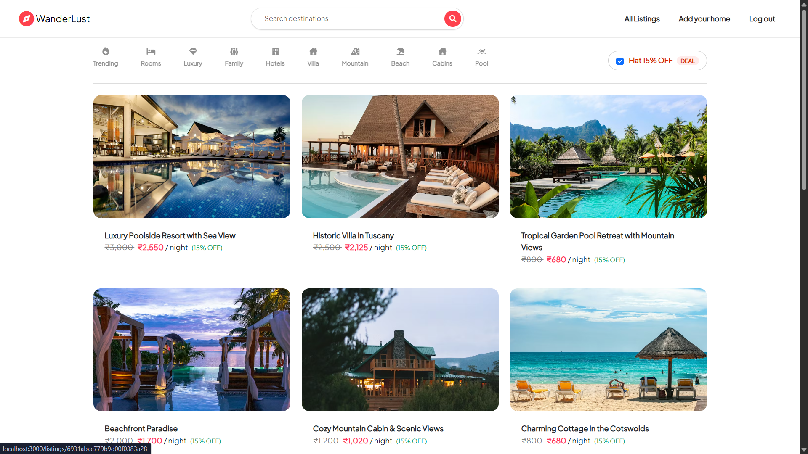
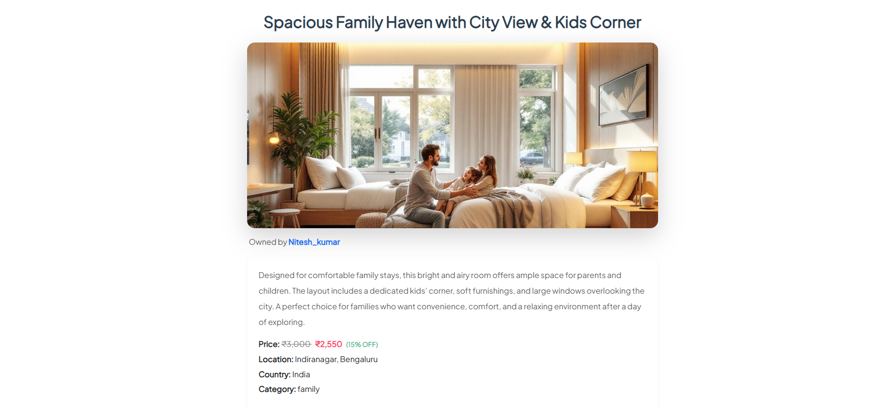
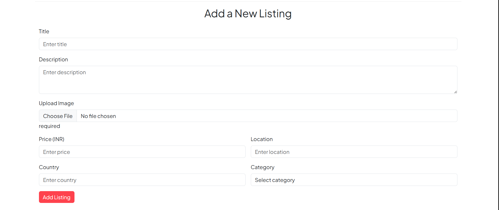
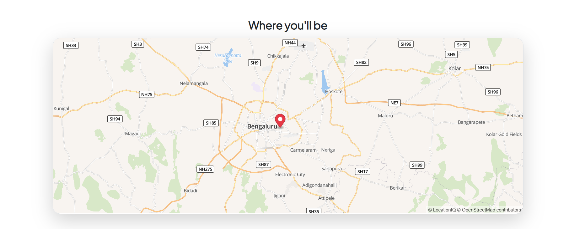

# WanderLust – Travel & Accommodation Platform

WanderLust is a full-stack travel and accommodation platform that allows users to discover, create, and manage property listings. The application provides authentication, reviews, location-based listings, image management, and an interactive map-based experience.

## 🚀 Features

- User Registration & Login
- User Authentication & Authorization
- Create, Edit & Delete Listings
- Property Details & Search
- Reviews & Ratings
- Image Upload & Management
- Location-based Listings
- Interactive Maps
- Flash Messages & Error Handling
- Responsive User Interface

## 🛠️ Tech Stack

### Frontend

- HTML
- CSS
- JavaScript
- EJS
- Bootstrap

### Backend

- Node.js
- Express.js

### Database

- MongoDB
- Mongoose

### Other Technologies

- Cloudinary
- Mapbox
- Passport.js
- Git & GitHub

## 📂 Project Structure

```text
WanderLust/
├── controllers/
├── init/
├── models/
├── public/
├── routes/
├── screenshots/
├── utils/
├── views/
├── .gitignore
├── app.js
├── cloudConfig.js
├── middleware.js
├── package.json
└── schema.js
```

## ⚙️ Installation

Clone the repository:

```bash
git clone https://github.com/mahtabpkb51/WanderLust-Travel-Platform.git
```

Navigate to the project directory:

```bash
cd WanderLust-Travel-Platform
```

Install the required dependencies:

```bash
npm install
```

## 🔐 Environment Variables

Create a `.env` file in the root directory and add your own credentials:

```env
MONGO_URL=your_mongodb_connection_string
CLOUDINARY_CLOUD_NAME=your_cloudinary_cloud_name
CLOUDINARY_KEY=your_cloudinary_key
CLOUDINARY_SECRET=your_cloudinary_secret
MAP_TOKEN=your_map_token
```

> ⚠️ Never upload your actual API keys, database credentials, or secrets to GitHub.

## ▶️ Run the Application

Start the development server:

```bash
npm run dev
```

Then open the application in your browser:

```text
http://localhost:8080
```

## 📸 Screenshots

### 🏠 Home Page



### 🏡 Listing Details



### ➕ New Listing



### 🗺️ Map



## 🚀 Future Improvements

- Online booking system
- Payment integration
- Advanced property filtering
- Wishlist functionality
- User profile management
- Improved mobile responsiveness
- User dashboard
- Advanced search and filtering

## 👨‍💻 Author

**Md Mahtab Alam**

GitHub: [@mahtabpkb51](https://github.com/mahtabpkb51)

## ⭐ Project

If you find this project useful, feel free to give it a star on GitHub.